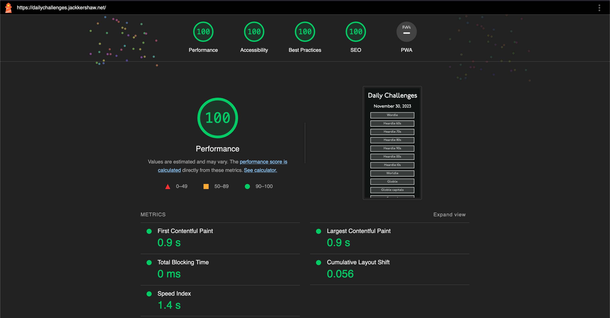

I wanted to build a website to link to all the daily challenges (like Wordle etc.). After making the initial design I decided to make some changes to the site:

- Changed the colour scheme to Wordle's based on user feedback.
- Ran Google Lighthouse on the site to check accessibility. Mostly positive, but it instructed me to:
  - Add a meta description
  - Use the font display option to swap font on page load.
  - Media query for desktop view. I originally designed for mobile which made things too big for desktop. Bizarrely I used vw for the font sizes so I changed that too.
  - Added a reset button.
  - Used local storage to save button click state so page reload doesn't change it and reset button colour when new day.
  - Edited the CSS to make it look better on different screen sizes.
  - Added view on Github button
  - Ran Google Lighthouse to check the accessibility of the site and got a report with 100 for all categories. 
- Deleted some challenges from the website to streamline it for new users. Added the excellent Hexcodle, a useful tool for developers learning about hexcodes and base-16.
- Added landmarks to improve accessibility.
- Added an intro screen, like on Wordle to explain what the website is about. Stored in local storage whether this has been clicked - if it has ever (i.e. not just today), don't show the popup again.
- Improved desktop css to show all the content.
- Added animations using Animista.

## Conclusion

You can find a live copy of the site at [dailychallenges.jackkershaw.net](https://dailychallenges.jackkershaw.net) and read more on the Github repository [here](https://github.com/jones58/daily-challenges).
